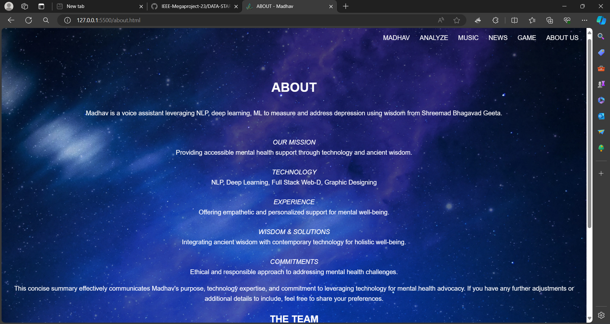
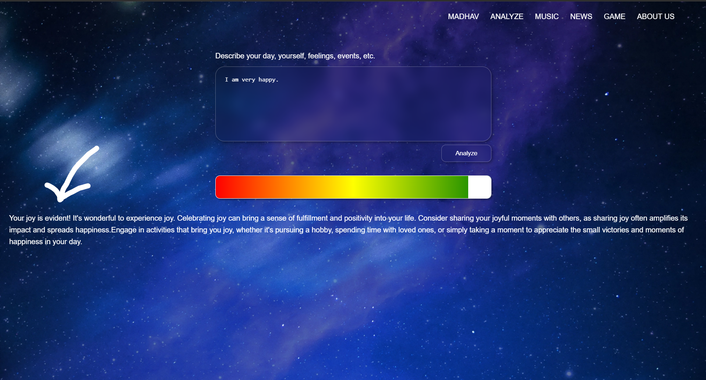
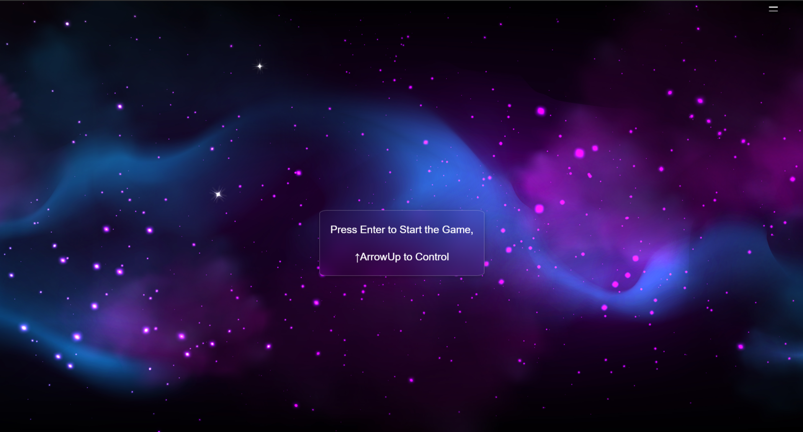

# Madhav

## Overview
Maadhav Voice Assistant is an AI-powered assistant built using Natural Language Processing (NLP) techniques and machine learning models. It utilizes the profound insights from the Shreemad Bhagavad Geeta to assist users in dealing with depression and enhancing their overall well-being.

## Features
1. AI Avatar (Madhav AI): Madhav AI features an AI-powered avatar capable of engaging in voice conversations with users. This interactive feature provides a supportive environment for users to express their feelings, thoughts, and concerns.

2. Mood Sentiment Analysis: The platform includes a depression tracker tool designed to help users monitor their mood patterns and track changes in their mental health over time. By logging daily experiences and emotions, users can gain valuable insights into their depressive episodes and progress.

3. Depression News Live: Madhav AI aggregates real-time news and updates related to depression from reputable sources. Users can stay informed about the latest developments in depression research, treatment options, and community initiatives, fostering a sense of awareness and empowerment.

4. Depression Relief Game: To promote relaxation and emotional well-being, Madhav AI offers a variety of interactive games specifically designed to alleviate depressive symptoms. These games serve as engaging distractions and stress-relievers, helping users unwind and find moments of joy amidst their struggles.

## Dependencies

Madhav Voice Assistant relies on the following dependencies:

1. Flask: Web framework for building the backend server.

2. Flask-CORS: Extension for handling Cross-Origin Resource Sharing (CORS) in Flask applications.

3. TensorFlow and Tflearn: Open-source machine learning framework for building and training models.

4. Keras: High-level neural networks API, running on top of TensorFlow.

5. NLTK: Natural Language Toolkit for NLP tasks such as stemming and tokenization.

6. Pandas, NumPy: Libraries for data manipulation and numerical operations.

## Future Improvements

Potential enhancements for Madhav Voice Assistant include:

1. Integration of additional features for mental health support, such as meditation guides and mindfulness exercises.
2. Expansion of the depression tracker tool with more advanced analytics and insights.
3. Incorporation of personalized recommendations based on user interaction and data analysis.
4. Collaboration with mental health professionals to ensure the effectiveness and reliability of the assistant's guidance.

## Contribution

Your feedback is valuable for improving Madhav Voice Assistant. Feel free to submit bug reports, suggestions, or contributions via the appropriate channels in the collaborative project.

For Contributing to this project:

1. Fork the Repository.

2. Create a new branch: git checkout -b my-feature-branch.

3. Make your changes and commit them: git commit -m 'Add some feature'.

4. Push to the branch: git push origin my-feature-branch.

5. Submit a pull request.

## Acknowledgements

Madhav Voice Assistant is not a substitute for professional medical advice or treatment. It is intended to provide support and guidance based on spiritual and philosophical principles. Users experiencing severe depression or mental health issues are advised to seek assistance from qualified professionals.

